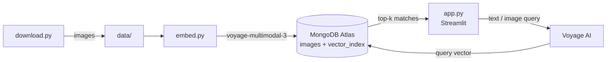

# Image Search

Multimodal image search over the [Wonders of the World](https://www.kaggle.com/datasets/balabaskar/wonders-of-the-world-image-classification) dataset using **Voyage AI** multimodal embeddings and **MongoDB Atlas Vector Search**. Search by a text description or by uploading an image.



## Project layout

| File | Purpose |
| --- | --- |
| `download.py` | Downloads the Kaggle dataset into `data/` |
| `embed.py` | Embeds every image with Voyage AI and upserts into MongoDB; creates the vector index |
| `app.py` | Streamlit search UI (text or image query, optional label filter) |
| `config.py` | Loads settings from `.env` |

## Prerequisites

- [uv](https://docs.astral.sh/uv/)
- A [Voyage AI](https://www.voyageai.com/) API key
- A MongoDB **Atlas** cluster (or local Atlas deployment) — `$vectorSearch` is not available on plain MongoDB Community
- Kaggle credentials for `kagglehub` (`~/.kaggle/kaggle.json` or `KAGGLE_USERNAME` / `KAGGLE_KEY`)

## Setup

```sh
uv sync
cp .env.example .env
```

Edit `.env`:

```env
VOYAGE_API_KEY=your-voyage-api-key
MONGODB_URI=mongodb+srv://<user>:<password>@<cluster>.mongodb.net/
MONGODB_DB=image_search
MONGODB_COLLECTION=images
VECTOR_INDEX_NAME=vector_index
VOYAGE_MODEL=voyage-multimodal-3
EMBEDDING_DIM=1024
```

## Usage

```sh
uv run download.py             # 1. fetch images into data/
uv run embed.py                # 2. embed + store in MongoDB, build vector index
uv run streamlit run app.py    # 3. open the search app
```

`embed.py` is resumable — images already stored (matched by path) are skipped. It runs batches in parallel; tune with `EMBED_WORKERS` (default 8) and `EMBED_BATCH_SIZE` (default 16) in `.env`. Lower `EMBED_WORKERS` if you hit Voyage AI rate limits.

### Stored document shape

```json
{
  "path": "Wonders of World/Wonders of World/taj_mahal/001.jpg",
  "label": "taj_mahal",
  "embedding": [0.0123, -0.0456, "... 1024 floats"]
}
```

### Vector index definition

```json
{
  "fields": [
    { "type": "vector", "path": "embedding", "numDimensions": 1024, "similarity": "cosine" },
    { "type": "filter", "path": "label" }
  ]
}
```

## Example queries

Labels in the dataset: `burj_khalifa`, `chichen_itza`, `christ_the_reedemer`, `eiffel_tower`, `great_wall_of_china`, `machu_pichu`, `pyramids_of_giza`, `roman_colosseum`, `statue_of_liberty`, `stonehenge`, `taj_mahal`, `venezuela_angel_falls`.

### Text queries (try in the "Text query" tab)

| Query | Expected matches |
| --- | --- |
| `white marble mausoleum reflected in a long pool` | taj_mahal |
| `tallest skyscraper in a desert city at night` | burj_khalifa |
| `iron lattice tower in Paris` | eiffel_tower |
| `ancient stone wall winding over green mountains` | great_wall_of_china |
| `Inca ruins on a mountain ridge surrounded by clouds` | machu_pichu |
| `step pyramid temple in the Mexican jungle` | chichen_itza |
| `giant statue with open arms overlooking a city` | christ_the_reedemer |
| `green copper statue holding a torch` | statue_of_liberty |
| `circle of huge standing stones in a grassy field` | stonehenge |
| `ruined ancient amphitheater in Rome` | roman_colosseum |
| `sandstone pyramids in the desert with camels` | pyramids_of_giza |
| `very tall waterfall dropping off a flat-topped mountain` | venezuela_angel_falls |
| `monument at sunset` | mixed — combine with the sidebar label filter |
| `aerial view from a drone` | mixed — tests composition rather than landmark |

### Image queries (try in the "Image query" tab)

- Upload any photo of a landmark (e.g. your own Eiffel Tower holiday photo) to find visually similar images.
- Upload an image from `data/` to find near-duplicates.
- Upload a sketch or painting of a pyramid to test cross-style similarity.

### Raw aggregation (mongosh / Compass)

Generate a query vector with Voyage AI first, then:

```js
db.images.aggregate([
  {
    $vectorSearch: {
      index: "vector_index",
      path: "embedding",
      queryVector: [/* 1024 floats */],
      numCandidates: 200,
      limit: 10,
      filter: { label: "taj_mahal" }   // optional
    }
  },
  { $project: { _id: 0, path: 1, label: 1, score: { $meta: "vectorSearchScore" } } }
])
```

Python equivalent:

```python
import voyageai, config
from pymongo import MongoClient

vo = voyageai.Client(api_key=config.VOYAGE_API_KEY)
vec = vo.multimodal_embed(
    inputs=[["white marble mausoleum"]], model=config.VOYAGE_MODEL, input_type="query"
).embeddings[0]

coll = MongoClient(config.MONGODB_URI)[config.MONGODB_DB][config.MONGODB_COLLECTION]
for doc in coll.aggregate([
    {"$vectorSearch": {"index": config.VECTOR_INDEX_NAME, "path": "embedding",
                       "queryVector": vec, "numCandidates": 200, "limit": 5}},
    {"$project": {"_id": 0, "path": 1, "label": 1, "score": {"$meta": "vectorSearchScore"}}},
]):
    print(doc)
```

## Troubleshooting

- **`$vectorSearch` returns nothing** — the index may still be building; check Atlas UI → Search Indexes, or rerun `embed.py` (it waits until the index is queryable).
- **Index creation fails** — the user in `MONGODB_URI` needs `Project Search Index Editor` / `readWrite` + search index permissions, or create the index manually with the definition above.
- **Changing `VOYAGE_MODEL`** — re-embed all images and recreate the index if the dimension changes.
